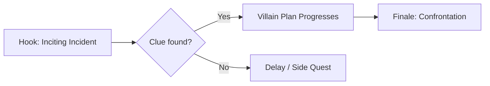

# Dashboard

## Campaign Heartbeat
- Date: {current_date_placeholder}
- Active Arc: {active_arc_placeholder}
- Current Threat Level: {threat_level_placeholder}
- Next Session Goal: {next_session_goal_placeholder}

## Quick Links
- Active Session: [[6_Journal/Session_01_{session_name_here}]]
- Current City: [[1_World/{Region_Name}/{City_Name}]]
- Current Villain: [[2_NPCs/{Region_Name}/{City_Name}/villain_name.md]]

## Next Session Prep Checklist
- [ ] Review previous session notes
- [ ] Update NPC locations and motivations
- [ ] Prepare encounter: {encounter_placeholder}
- [ ] Print/confirm maps
- [ ] Prepare 3 roleplay hooks
- [ ] Check loot & XP budgets

## Villain Scheme Progress

## Private Notes
- This folder is DM-only. Keep secrets, retcons, and player-negotiated material here.
- Use `TODOs.md` for backlog tasks and `Scratchpad.md` for session-time brain dumps.
